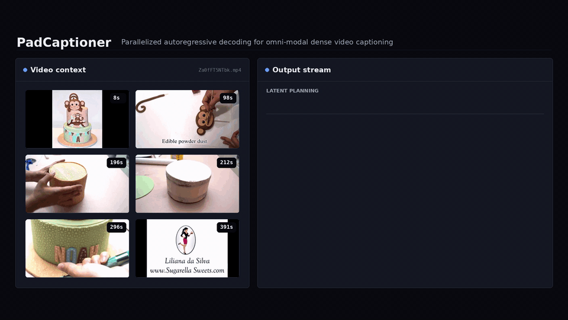

<h1 align="center">🎬 PadCaptioner</h1>

<h3 align="center">Parallelized Autoregressive Decoding for Omni-Modal Dense Video Captioning</h3>

<p align="center">
  Wenzheng Zeng, Siyi Jiao, Chen Gao, Hwee Tou Ng, Mike Zheng Shou
</p>

<p align="center">National University of Singapore</p>

<h3 align="center">ECCV 2026</h3>

<p align="center">
  <a href="https://arxiv.org/pdf/2607.02963">Paper</a> &nbsp; | &nbsp;
  <a href="https://huggingface.co/papers/2607.02963">HF Daily Paper</a> &nbsp; | &nbsp;
  <a href="#demo">Demo</a> &nbsp; | &nbsp;
  <a href="#news">News</a> &nbsp; | &nbsp;
  <a href="#overview">Overview</a>
</p>


## Demo

<p align="center">
  <a href="media/padcaptioner_demo.mp4">
    
  </a>
</p>

<p align="center">
  <a href="media/padcaptioner_demo.mp4">Click here to watch the demo video in MP4 format</a>
</p>


## 📢 News
- [2026-08] We are currently organizing and cleaning up the code and plan to release it within one week.
- [2026-07] Our work is featured by [DailyPapers](https://x.com/HuggingPapers/status/2076401494295826468)!
- [2026-07] Our paper is available on [arXiv](https://arxiv.org/abs/2607.02963).
- [2026-06] Our work is accepted by ECCV 2026!

## 🔆 Overview

We propose **PadCaptioner**, a 3B model for omni-modal dense video captioning that achieves high efficiency and strong grounded caption quality, outperforming 7B counterparts.

The core idea is to exploit the weak local dependencies among temporally distinct events and restructure the causal token dependency, enabling lossless parallel generation.

We design a latent planning mechanism that automatically determines parallelizable units with non-local awareness, guiding subsequent parallel decoding and improving event grounding and caption quality.


## 📌 Citation
If you find our work useful, please kindly cite:
  ```
  @inproceedings{padcaptioner,
    title={Parallelized Autoregressive Decoding for Omni-Modal Dense Video Captioning},
    author={Zeng, Wenzheng and Jiao, Siyi and Gao, Chen and Ng, Hwee Tou and Shou, Mike Zheng},
    booktitle={European Conference on Computer Vision (ECCV)},
    year={2026}
  }
  ```
